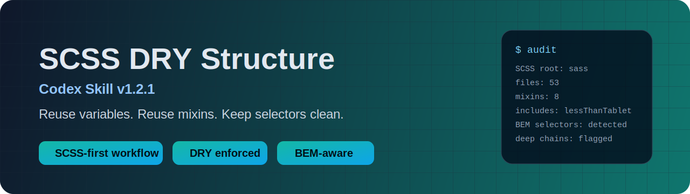

# SCSS DRY Structure




Build SCSS changes that respect existing architecture, reuse existing tokens, and stay maintainable as the codebase grows.

## Why this skill

Most styling regressions happen when changes are added in the wrong place or by duplicating existing logic.  
This skill gives Codex a strict workflow to:

- map your SCSS structure before editing
- find and reuse existing variables, mixins, and selectors
- keep nesting shallow and readable
- follow established naming conventions, including BEM where present

## Install (30 seconds)

Recommended (pinned release tag):

```bash
$skill-installer install https://github.com/mrwigster/scss-dry-structure/tree/v1.2.1
```

Latest development branch (optional):

```bash
$skill-installer install https://github.com/mrwigster/scss-dry-structure/tree/main
```

Manual install (main):

```bash
git clone https://github.com/mrwigster/scss-dry-structure.git ~/.codex/skills/scss-dry-structure
```

## Quick Start

From your project root:

```bash
export CODEX_HOME="${CODEX_HOME:-$HOME/.codex}"
"$CODEX_HOME/skills/scss-dry-structure/scripts/scss_audit.sh"
```

The script auto-detects common SCSS roots (`sass/`, `scss/`, `assets/scss/`, `public/assets/scss/`, etc.).  
If needed, pass an explicit root path as the first argument.

Then ask Codex to implement your style change using this skill.

## Example Prompts

- "Refactor this CSS block into existing SCSS partials and reuse current variables/mixins."
- "Add responsive styles for this card component without introducing duplicate breakpoints."
- "Find whether this selector already exists and apply updates in the correct partial."
- "Audit this SCSS folder and tell me exactly where a new feature style should live."
- "Convert these repeated declarations into a shared mixin and replace duplicates."
- "Check if this module should use BEM or local kebab-case based on nearby files."

## Before And After

Before (duplicated logic, deep selector chain):

```scss
.product-grid .card .title {
  color: #11765f;
  font-size: 22px;
}
.product-grid .card .cta {
  color: #11765f;
  border-radius: 10px;
}
```

After (token reuse, cleaner structure):

```scss
$card-accent: $brand-secondary-complement;

.product-grid {
  .card {
    &__title {
      color: $card-accent;
      font-size: 1.375rem;
    }

    &__cta {
      color: $card-accent;
      border-radius: $radiusSize;
    }
  }
}
```

## Result Snapshot

The bundled audit script quickly surfaces structure and conventions, for example:

- SCSS root and entrypoints
- import/use patterns already in place
- existing mixins and most-used includes
- existing CSS custom property definitions and usage hotspots
- existing Sass variable definitions
- cascade layer declarations and usage
- BEM-style selector usage
- potential deep selector chains to review

## What It Enforces

- SCSS-first placement in existing partial architecture
- DRY-first token reuse before adding new variables/mixins
- custom-property-aware token reuse (`--token` / `var(--token)`)
- layer-aware placement when `@layer` exists
- maintainable nesting and selector depth
- convention matching instead of style drift

## Repository Layout

- `SKILL.md`: core operating instructions for the agent
- `scripts/scss_audit.sh`: SCSS structure and convention audit
- `references/scss-patterns.md`: naming and architecture guardrails
- `agents/openai.yaml`: Codex UI metadata
- `assets/scss-dry-structure-banner.svg`: repository banner image

## Release

- Current release: `v1.2.1` (2026-02-18)
- Focus: CI smoke-test dependency fix (`ripgrep` install in workflow) plus all `v1.2.0` enhancements
